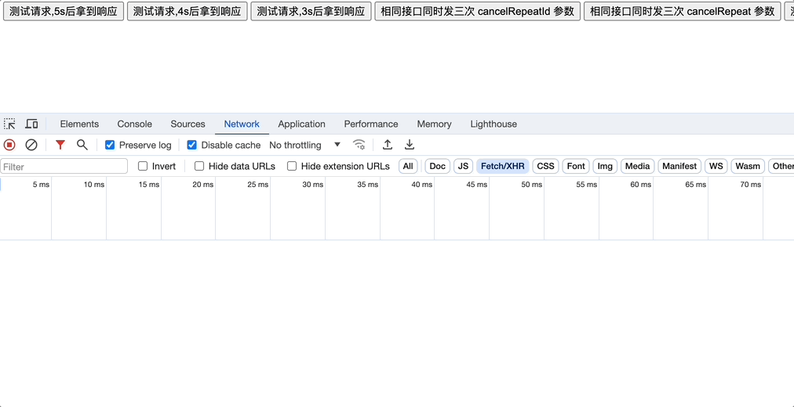

# axios-smart

[](https://npmjs.org/package/axios-smart)
[](https://npmjs.org/package/axios-smart)

## 安装

```bash
$ yarn install axios-smart
```

## 用法

axios-smart是一些小特性的集合。

- axios-cancel-repeat

第一次发送请求，修改查询条件，即使第一个请求尚未完成，也发送第二个请求。此时，第一个请求的返回结果变得毫无价值，我们应该取消第一个请求。

一旦您使用了 axios-smart, axios-cancel-repeat 特性将自动可用，并且您不能取消它。

``` js
import axios from 'axios'
import { axiosSmart } from 'axios-smart'

axiosSmart(axios)
```

业务开发中会遇到同一个接口发多次的情况，添加 cancelRepeatId 参数即可。

``` js
axios.all([1,2,3].map(item => {
  return axios.get('https://httpbin.org/delay/5', { cancelRepeatId: item })
})).then(result => {
  console.log('result', result)
})
```

也可以使用 cancelRepeat 参数。

``` js
axios.all([1,2,3].map(item => {
  return axios.get('https://httpbin.org/delay/5', { cancelRepeat: true })
})).then(result => {
  console.log('result', result)
})
```

cancelRepeatId 和 cancelRepeat 的区别?

并发发送多个接口，之前的接口未完成时再次点击按钮，cancelRepeatId 会取消之前的接口重发请求


而 cancelRepeat 不会取消之前的请求。



- axios-cancel-pending

从一个页面跳转到另一个页面，应该取消前一个页面上未完成的请求。

您可以在任何项目中自定义如何取消请求。

``` js
import axios from 'axios'
import { axiosSmart, cancelPending } from 'axios-smart'

axiosSmart(axios)

// 取消所有未完成的请求
cancelPending()
```

React 中使用例子:

``` js
import axios from 'axios'
import { axiosSmart, useCancelPendingWhenLeavePage } from 'axios-smart'

/**
 *  useCancelPendingWhenLeavePage(): cancelPending() 内部代码如下
 * 
 *  useEffect(() => {
 *      return () => {
 *          cancelPending()
 *      }
 *  }, [ window.location.pathname ])
 */
useCancelPendingWhenLeavePage()

axiosSmart(axios)

axios.get('https://httpbin.org/status/503')
```

- axios-retry

有时由于网络不稳定，第一次请求失败，刷新页面后第二次请求成功。

axios-retry 会在请求失败时，自动重发请求，默认最多重试2次请求。

如果不想重新发送请求，可以按以下方式设置。

``` js
import axios from 'axios'
import { axiosSmart } from 'axios-smart'

axiosSmart(axios, {
    retry: {
        enable: false,       // 默认值是 true
    }
})

axios.get('https://httpbin.org/status/503')
```

retry.retries: 定义重试次数，默认值是 2

retry.retryCondition: 定义重试条件，默认是响应状态码不等于200时进行重试

``` js
axiosSmart(axios, {
    retry: {
        enable: true,       // 默认值是 true
        retries: 2,         // 默认值是 2
        retryCondition: (error: AxiosError) => error.response?.status !== 200,
    }
})
```

- axios-loading

当发送请求时，浏览器顶部会自动添加一个进度条。 
 
如果更改查询条件并重新发送请求，则进度条将重置并重新开始。 
 
当所有请求完成后，进度条将自动消失。 
 
如果您不想要这个功能，您需要手动关闭它。

``` js
import axios from 'axios'
import { axiosSmart } from 'axios-smart'
// 需要引入进度条样式文件
import 'axios-smart/dist/esm/axios-smart.css'

axiosSmart(axios, {
    loading: {
        enable: false,       // default value is true
    }
})

axios.get('https://httpbin.org/delay/5')
```

你可以在任何地方单独使用 loadingBar

``` js
import { loadingBar } from 'axios-smart'

loadingBar.start()
loadingBar.done()
```

如果你需要改变进度条的样式，你可以直接在全局css文件中覆盖这些类名

``` css
.axios-smart-progress-bar {
  position: fixed;
  z-index: 99999999;
  top: 0;
  left: 0;
  height: 3px;
  background-color: #ec7765;
}

.axios-smart-progress-bar-animation {
  animation: axios-smart-progress-bar-loading 60s ease-out;
  animation-fill-mode: forwards;
}

@keyframes axios-smart-progress-bar-loading {
  0% {
    width: 1%;
  }

  100% {
    width: 98%;
  }
}
```

## 开发

``` bash
$ git clone git@github.com:dkvirus/axios-smart.git
$ cd axios-smart
$ yarn
$ yarn dev
```

您可以修改 src 目录中的源代码，并打开 test/axios-smart.html 来测试它。

## LICENSE

MIT
